# Aula 05
## Descrição
Este BackEnd serve para administrar o inventario de itens de uma empresa, utilizando de ferramentas para listar, registrar, atualizar, apagar e procurar.
## Instruções
Para testar o programa clone este repositorio, abra com o VisualStudio Code e utilize a extensão Thunder Client.

Para o programa funcionar execute o seguinte comando no cmd
```cmd
npm run dev
```

Em dúvidas sobre como utilizar olhe os exemplos mais abaixo.
## Tecnologias utilizadas
Linguagem JSON e JavaScript por meio do VisualStudio Code.
Para os testes foi utilizado a extensão Thunder Client
## Listas das Rotas Disponiveis
GET
PUT
POST
DELETE
## Exemplos de Requisições
Aqui você altera o tipo de ação

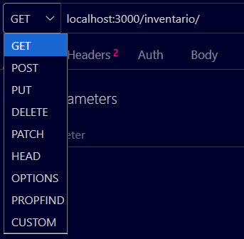

### 1. Listando os itens:
**GET** localhost:3000/inventario/
Clique em **SEND**

### 2. Registrando um item novo:
**POST** localhost:3000/inventario/

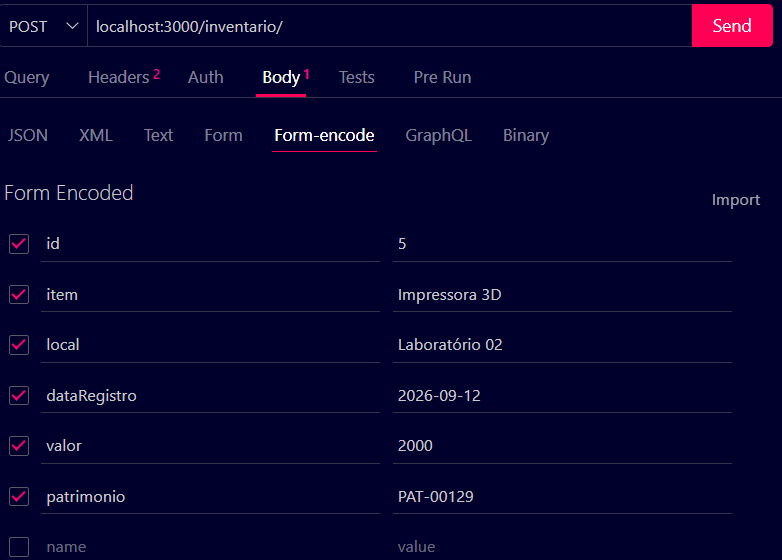

Clique em **SEND**

### 3. Deletando um item:
**DELETE** localhost:3000/inventario/(id)

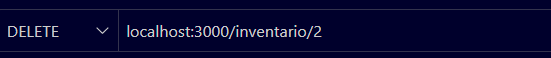

### 4. Atualizar um item:
**PUT** localhost:3000/inventario/(id)

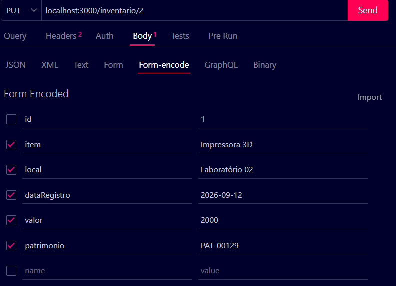

### 5. Procurando um item especifico:
**GET** localhost:3000/inventario/(id)

## Exemplos de respostas

### 1. Listando itens:
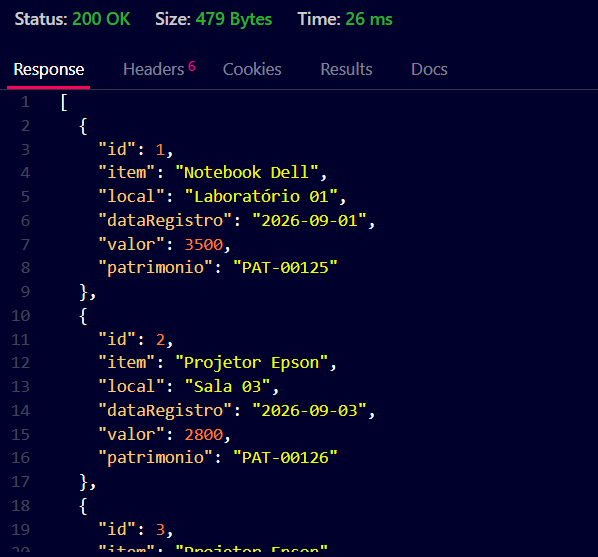

### 2. Registrando um item novo:
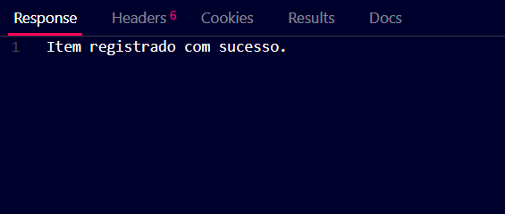

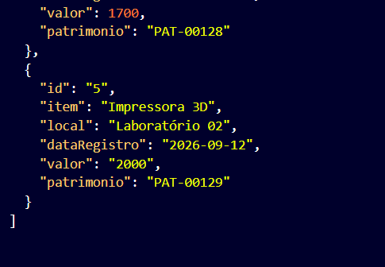

### 3. Deletando um item:
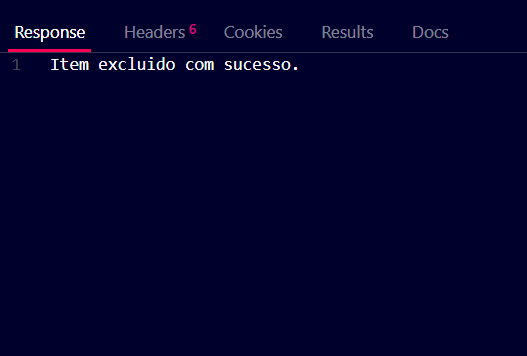

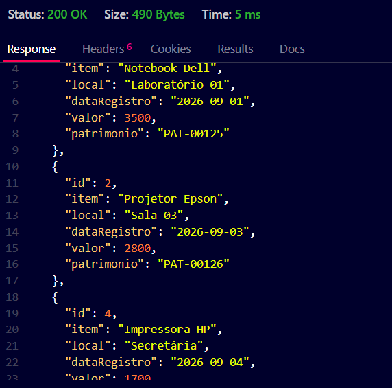
#### Caso não encontre:
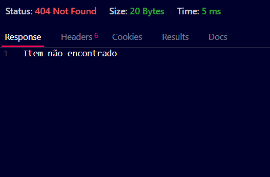

### 4. Atualizar um item:
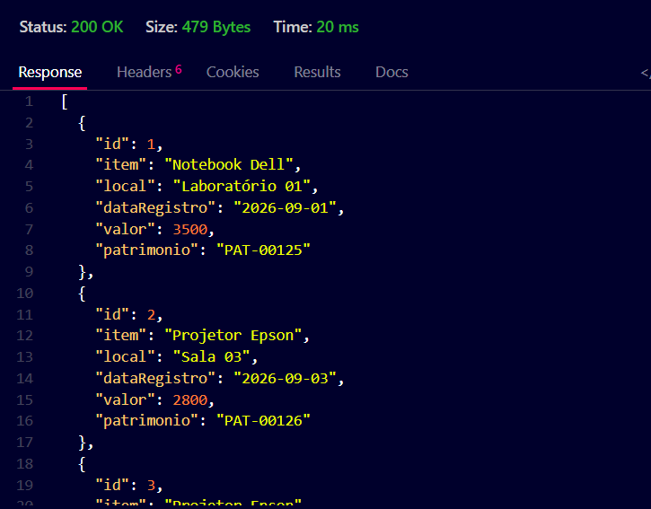

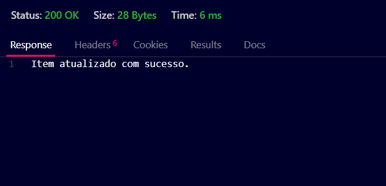

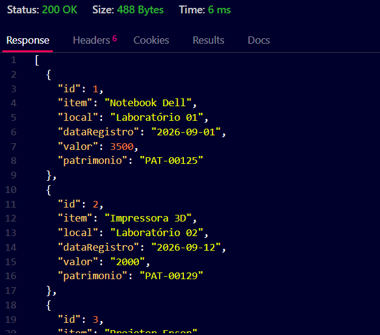
#### Caso não encontre:
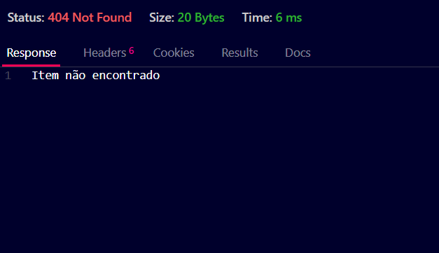

### 5. Procurar um item especifico
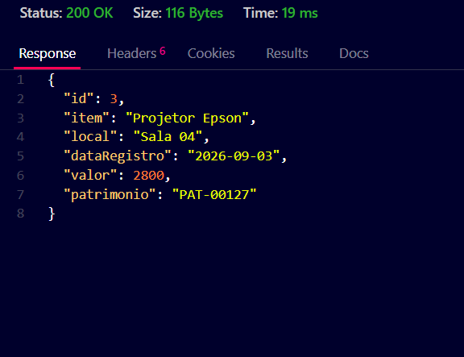
#### Caso não encontre:
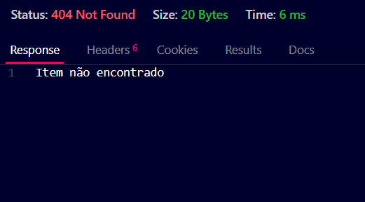

